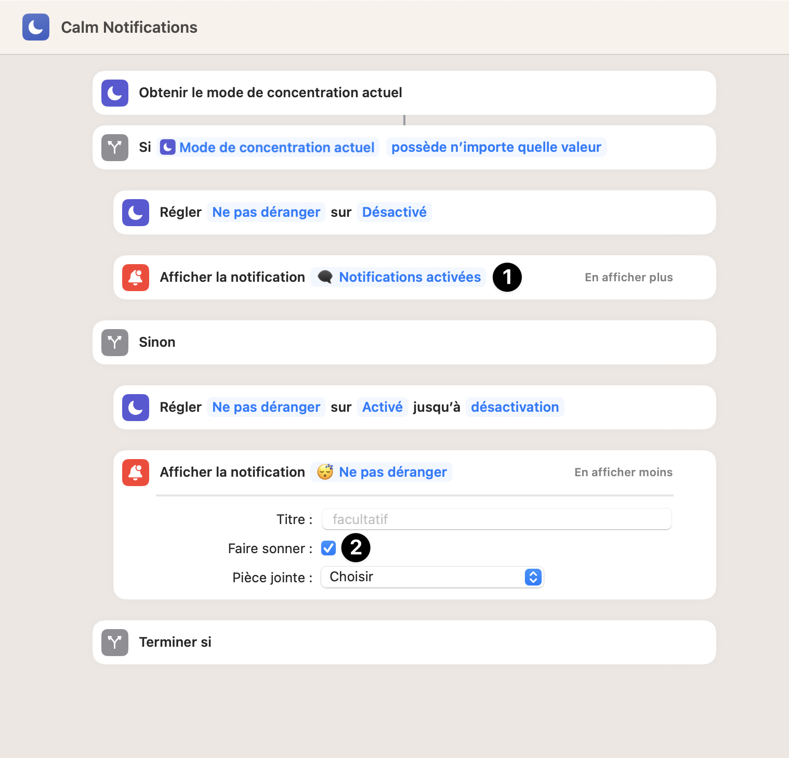

# Alfred Shortcut Workflow

## Description
FR : Ce workflow pour Alfred permet de créer et gérer une variété de raccourcis clavier pour exécuter des actions spécifiques rapidement et efficacement. 

EN : This workflow for Alfred lets you create and manage a variety of keyboard shortcuts to perform specific actions quickly and efficiently.

## Installation
- Téléchargez le fichier __.alfredworkflow__ à partir de ce dépôt GitHub.
- Double-cliquez sur le fichier __.alfredworkflow__ pour l'installer dans Alfred.
- Activez le workflow dans la section "Workflows" de l'application Alfred.

---

- Download the __.alfredworkflow__ file from this GitHub repository.
- Double-click on __.alfredworkflow__ to install it in Alfred.
- Activate the workflow in the "Workflows" section of the Alfred application.

## Liste des raccourcis / List of shortcuts
- [Calm Notifications](#calm-notifications---installations)

### Calm Notifications

- Activer/Désactiver les Notifications sur macOS
- Raccourci clavier : `⌃ + ⌘ + ↩` (Ctrl + Cmd + Entrée) -> Si vous voulez changer le raccourci clavier, vous pouvez le faire dans les paramètres du workflow (sur le trigger Hotkey)
- Dans les raccourcis de votre mac [Raccourcis.app [↗]](https://support.apple.com/fr-fr/guide/shortcuts-mac/apd84c576f8c/mac) / il faudra créer un nouveau raccourcie similaire à celui-ci :

---

- Enable/Disable Notifications on macOS
- Keyboard shortcut: `⌃ + ⌘ + ` (Ctrl + Cmd + Enter) -> If you want to change the keyboard shortcut, you can do so in the workflow settings (on the Hotkey trigger)
- In your mac's shortcuts [Shortcuts.app []](https://support.apple.com/guide/shortcuts-mac/create-a-custom-shortcut-apd84c576f8c/mac) / you'll need to create a new shortcut similar to this one:

1. Vous pouvez changer le texte de la notification
2. Vous pouvez activer ou non le son de la notification et/ou ajouter un titre

L'avantage de ce raccourcie est qu'il ne dépend d'aucune librairies tierces. Tout est déjà disponible sur votre mac 💪.

## Contribution
Si vous avez des idées pour de nouveaux raccourcis clavier ou des améliorations à apporter à ce workflow, n'hésitez pas à ouvrir une issue ou à soumettre une pull request sur ce dépôt GitHub.